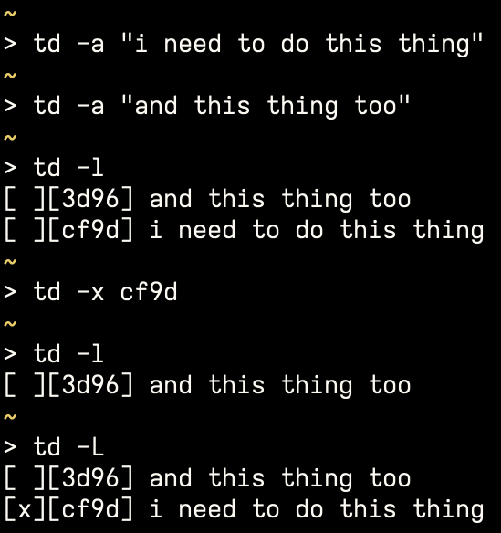

# td

Tested on Debian and OSX.

```
td: command-line to-do
Usage: td [options]

Raw content written to ~/.td/tasks

GNU sed is needed - default on most Linux installations,
needs to be installed on MacOS with homebrew

Options:
-a item 	Add a new to-do item
-x item_hash	Mark an item done
-l		List (pending) to-do items
-L		List (all) to-do items

Examples:
td -a "push code"
td -l
td -x d8e8
td -L

- Anish Sujanani, 2023
```

If you have entered the same item multiple times, marking the hash will `x` all copies.  i.e. ```td -a "test"; td -a "test"; td -x "098f"``` will `x` both `"test"` items.

If you'd like to mark multiple items at once, either edit the raw file or use something like `xargs`:  
```echo -e "aaaa\nbbbb" | xargs -I % td -x %```


